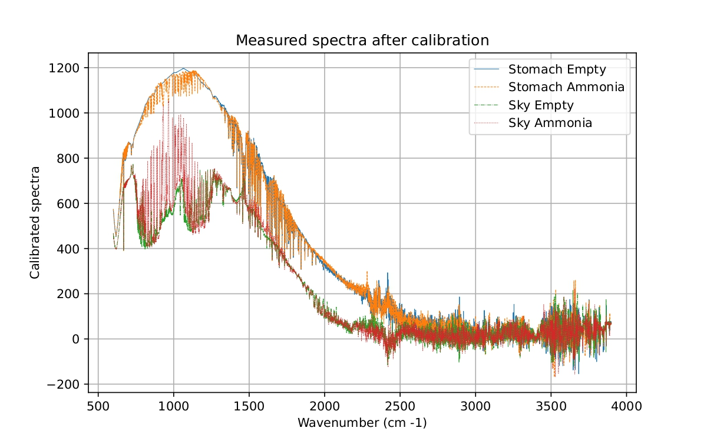

# Remote_Sensing_Systems
Worked with remote sensors at system level, from signal acquisition to data processing. Performed FTIR calibration and atmospheric retrievals using Python, and implemented radar CFAR detection and SAR imaging with MATLAB using real data acquired from physical lab instrumentation.

# 🛰️ Remote Sensing Systems Laboratory

This repository contains two complete remote sensing projects developed during academic lab sessions:
- **FTIR Spectroscopy** for atmospheric gas and temperature estimation
- **FMCW Radar and Synthetic Aperture Radar (SAR)** for object detection and imaging

Both projects are based on real sensor data and include full processing pipelines, from raw acquisition to final analysis and visualization.

---

## 📁 Repository Structure

<pre>
FCMW_and_SAR/
├── data/ 
├── CFAR_Detection_Video 
├── developing.m
├── help_code.m
└── movie_maker.m
  
FTIR/
├── base_spectra/ # Reference gas spectra retrieved from scientific databases
├── elektro_files/ # Spectra files measured during the laboratory session
├── images/ # All images used in the final report
├── FTIR_scripts.ipynb # Python code for loading, calibrating and analyzing the spectra
├── FTIR_scripts.pdf # Printable version of the code (PDF)
└── Laboratory_Report.pdf # Final report with methodology and results
</pre>

---

## 🔬 FTIR Spectroscopy Project

- **Goal**: Estimate atmospheric temperature and ammonia concentration using FTIR data
- **Methods**: Radiometric calibration, black-body fitting, and spectral inversion
- **Tools**: Python, NumPy, SciPy, Matplotlib
- **Data**: Real measurements from lab instruments + reference spectra

### ▶️ Report and Code
- 📄 [`FTIR_scripts.ipynb`](FTIR/FTIR_scripts.ipynb): Main notebook for processing
- 📘 [`Laboratory_Report.pdf`](FTIR/Laboratory_Report.pdf): Methodology and results

Below is a sample plot from the analysis:

  

---

## 📡 FMCW Radar & SAR Imaging Project

- **Goal**: Detect and visualize objects using short-range radar and SAR techniques
- **Sensors**: Texas Instruments AWR1843 FMCW radar module (77 GHz)
- **Processing**: Range-Doppler maps, CFAR object detection, SAR image reconstruction
- **Tools**: MATLAB

### 🎥 Demo Video

  

> Replace `YOUR_VIDEO_ID` with your actual YouTube video ID if you upload it

---

## ⚙️ Requirements

### FTIR:
- Python 3.x
- Jupyter Notebook
- `numpy`, `scipy`, `matplotlib`

### FMCW Radar:
- MATLAB (tested with R2023a or later)
- Basic familiarity with signal processing and radar concepts

---

